# ScreenProvider

===

This project has adopted the [Microsoft Open Source Code of Conduct](http://microsoft.github.io/codeofconduct). For more information see the [Code of Conduct FAQ](http://microsoft.github.io/codeofconduct/faq.md) or contact [opencode@microsoft.com](mailto:opencode@microsoft.com) with any additional questions or comments. 


# Raspberry Pi Example


[This project explains](https://www.hackster.io/windows-iot/windows-10-iot-core-for-adafruit-spi-touchscreen-bb3795) how to use a capacitive touch screen for Raspberry Pi with Windows IoT Core.

To support this screen, a kernel-mode display-only driver was created to establish direct access to the Adafruit PiTFT display via SPI. The driver initializes the display and presents at 16 frames per second.

To allow for direct user interaction with the display, a User-Mode Touch Injection Background Service establishes touch input through an I2C bus and uses a HID injection driver to inject touch events. Touch capabilities include single point touch (pressing) and swiping. UWP XAML windows application running on the Pi will present without any changes.


## Initial Setup

1. Set up your PC and Raspberry Pi according to [these instructions](https://developer.microsoft.com/en-us/windows/iot/GetStarted.htm).


2. Next, match the pins of the Adafruit PiTFT to those of the Pi to mount the display.


---


---


3. __Software Setup__: From the initial setup, be sure to note your Raspberry Pi's IP address as this will be necessary going forward. This project currently requires that you build several drivers and user mode applications.  

Please install the following environments:

* [Visual Studio 2015 Update 3 or later](https://www.visualstudio.com/)
* [Windows Driver Development Kit](https://developer.microsoft.com/en-us/windows/hardware/windows-driver-kit)


4. Download the screen provider source code from [Github](https://github.com/ms-iot/ScreenProvider) and extract to your file system. Note the location.


5. Open a command window, and change the directory to where you extracted the screen provider source code. Navigate to the directory `\drivers\fixedkmdod\KMDOD`.


6. Compile the spidisplay.asl file using the following command:

`"C:\Program Files (x86)\Windows Kits\10\Tools\x86\ACPIVerify\asl.exe" spidisplay.asl` 


---

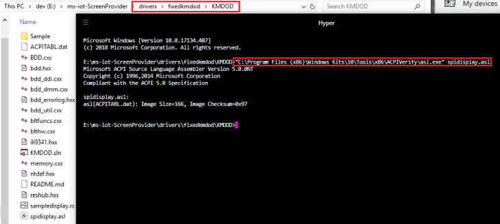

---


7. Open the solution in the kmdod folder and compile this driver for ARM.


---

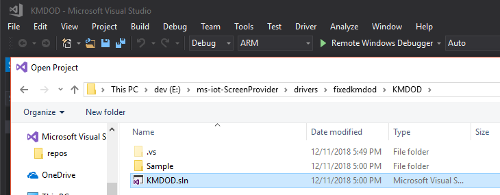

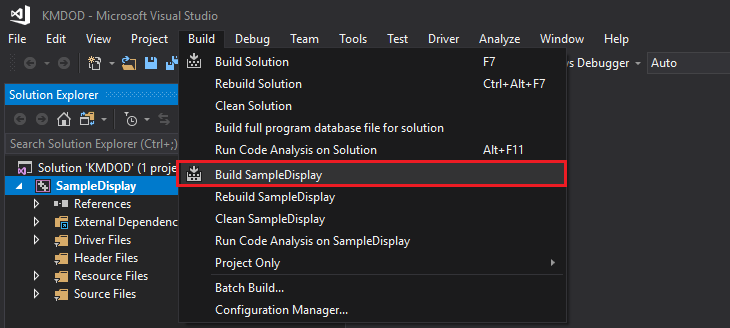

---


```
1>------ Build started: Project: SampleDisplay, Configuration: Debug ARM ------
1>Building 'SampleDisplay' with toolset 'WindowsKernelModeDriver10.0' and the 'Universal' target platform.
1>C:\Program Files (x86)\Microsoft Visual Studio\2017\Community\Common7\IDE\VC\VCTargets\Microsoft.CppBuild.targets(402,5): warning MSB8038: Spectre mitigation is enabled but Spectre mitigated libraries are not found.  Verify that the Visual Studio Workload includes the Spectre mitigated libraries.  See https://aka.ms/Ofhn4c for more information.
1>Stamping ARM\Debug\sampledisplay.inf
1>Stamping [Version] section with DriverVer=12/11/2018,17.56.26.778
1>BDD.cxx
1>BDD_DDI.cxx
1>BDD_DMM.cxx
1>BDD_Util.cxx
1>BltFuncs.cxx
1>BltHw.cxx
1>memory.cxx
1>Generating code
1>Finished generating code
1>SampleDisplay.vcxproj -> E:\ms-iot-ScreenProvider\drivers\fixedkmdod\KMDOD\Sample\ARM\Debug\SampleDisplay.sys
1>Done Adding Additional Store
1>Successfully signed: E:\ms-iot-ScreenProvider\drivers\fixedkmdod\KMDOD\Sample\ARM\Debug\SampleDisplay.sys
1>
1>Driver is a Universal Driver.
1>Done building project "SampleDisplay.vcxproj".
========== Build: 1 succeeded, 0 failed, 0 up-to-date, 0 skipped ==========
```


8. Open a run dialog and navigate to your Raspberry Pi over the network.

\\<your IP address>\C$


9. Create a directory called 'Deploy' on the Raspberry Pi and copy the following files from your computer to that new directory:

__.\drivers\fixedkmdod\KMDOD__

```
ACPITABL.dat
```


---

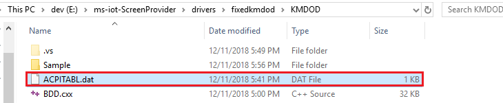

---


__.\drivers\fixedkmdod\KMDOD\Sample\ARM\Debug__

```
SampleDisplay.inf
SampleDisplay.sys
```


---

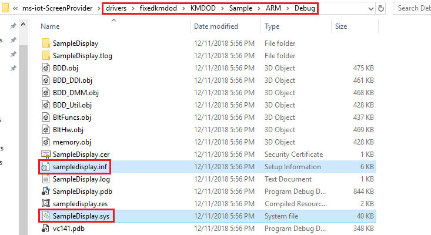

---


10. The file sharing server on your Windows IoT Core device starts automatically on boot. In order to connect to it, you need the IP address of your device. You can find the IP address on the [Windows 10 IoT Core Dashboard](https://docs.microsoft.com/en-us/windows/iot-core/tutorials/quickstarter/devicesetup#using-the-iot-dashboard-raspberry-pi-minnowboard-nxp). Once you have the IP, open up File Explorer on your computer and type `\\<TARGET_DEVICE>\c$`, where `<TARGET_DEVICE>` is either the name or the IP Address of your Windows IoT Core device, then hit Enter.


---

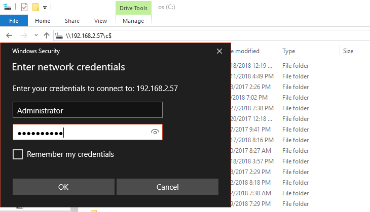

---


Login with your _Administrator_ account, create a folder called __Projects__ and upload the files `SampleDisplay.inf` and `SampleDisplay.sys` you just prepared:


---

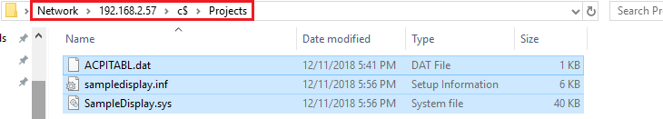

---


11. And copy the `ACPITABL.dat` file to `C:\Windows\System32`. The display driver should now have all the correct files.


---

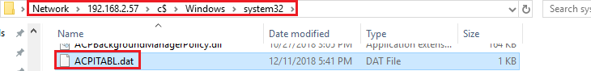

---


12. You can use the [Windows 10 IoT Core Dashboard](https://docs.microsoft.com/en-us/windows/iot-core/tutorials/quickstarter/devicesetup#using-the-iot-dashboard-raspberry-pi-minnowboard-nxp) to connect to your Pi with PowerShell:


---

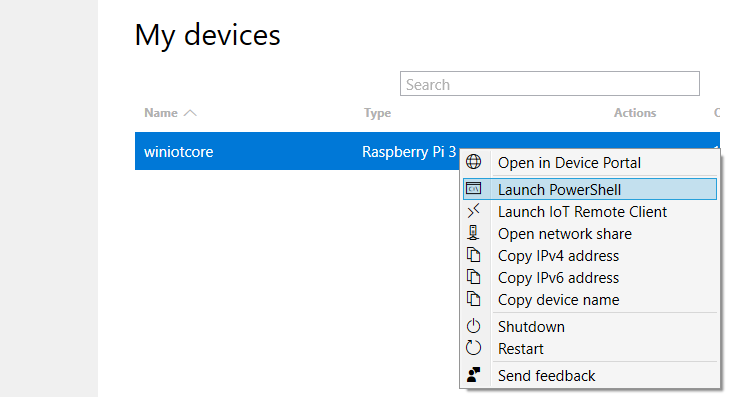

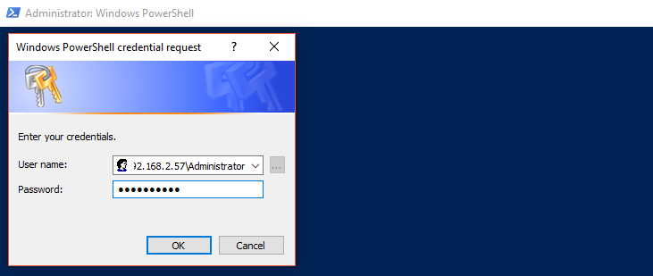

---


Install the driver package in your terminal by running the command below. You can check to make sure it's added using `devcon dp_enum` or delete it with `devcon dp_delete`:


```
devcon dp_add C:\Projects\sampledisplay.inf
```


---

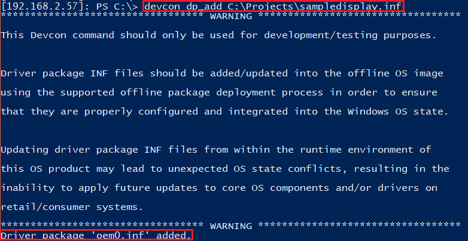

---

Restart your Pi to see the display running.


---

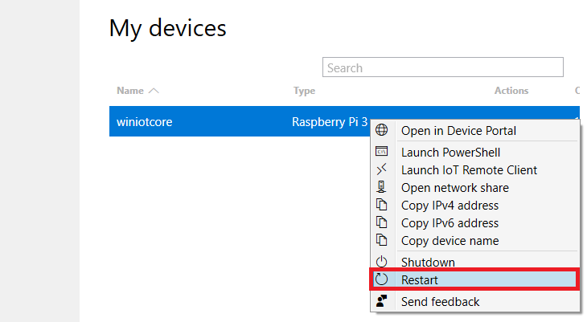

---


12. Adding Touch: Follow [these instructions](https://docs.microsoft.com/en-us/windows-hardware/drivers/hid/index) to setup the HID Injection driver.


13. Put HidInjector.exe from the project folder into the deploy folder.


14. Schedule the HidInjector to run on boot by running this command on the Raspberry Pi via SSH:

```
schtasks.exe /Create /SC ONSTART /TN \Microsoft\Windows\HidInjector\Start /TR %SystemRoot%\Deploy\HidInjector.exe
```

15. Restart your Raspberry Pi.